# Lab 01 - The Integrated Machine Learning Process in Synapse Analytics

This lab demonstrates the integrated, end-to-end Azure Machine Learning experience in Azure Synapse Analytics. You will learn how to connect an Azure Synapse Analytics workspace to an Azure Machine Learning workspace using a Linked Service and then trigger an Automated ML experiment that uses data from a Spark table.

After completing the lab, you will understand the main steps of an end-to-end Machine Learning process that build on top of the integration between Azure Synapse Analytics and Azure Machine Learning.

This lab has the following structure:

- [Lab 01 - The Integrated Machine Learning Process in Synapse Analytics](#lab-01---the-integrated-machine-learning-process-in-synapse-analytics)
  - [Before the hands-on lab](#before-the-hands-on-lab)
    - [Task 1 - Register for the hands-on lab](#task-1---register-for-the-hands-on-lab)
    - [Task 2 - Check lab credentials](#task-2---check-lab-credentials)
  - [Exercise 1 - Create an Azure Machine Learning linked service](#exercise-1---create-an-azure-machine-learning-linked-service)
    - [Task 1 - Create and configure an Azure Machine Learning linked service in Synapse Studio](#task-1---create-and-configure-an-azure-machine-learning-linked-service-in-synapse-studio)
    - [Task 2 - Explore Azure Machine Learning integration features in Synapse Studio](#task-2---explore-azure-machine-learning-integration-features-in-synapse-studio)
  - [Exercise 2 - Trigger an Auto ML experiment using data from a Spark table](#exercise-2---trigger-an-auto-ml-experiment-using-data-from-a-spark-table)
    - [Task 1 - Trigger a regression Auto ML experiment on a Spark table](#task-1---trigger-a-regression-auto-ml-experiment-on-a-spark-table)
    - [Task 2 - View experiment details in Azure Machine Learning workspace](#task-2---view-experiment-details-in-azure-machine-learning-workspace)
  - [Resources](#resources)
  

## Before the hands-on lab

### Task 1 - Register for the hands-on lab

Follow your instructor's indications and register for the hands-on lab. Once registration is complete and your lab environment is available, proceed to the next task.

### Task 2 - Check lab credentials

Once lab registration is complete and your lab environment is available, you should be able to view the details of your lab environment. The `Environment Details` tab displays your Azure AD user credentials:

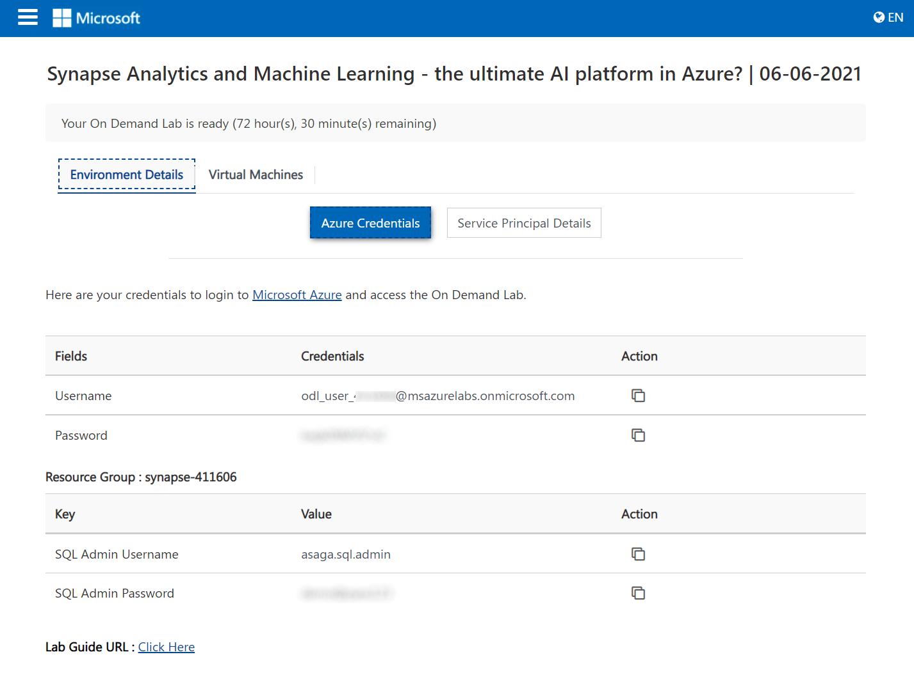

Select `Service Principal Details` to view the credentials of the service pricinpal you will use in the lab:

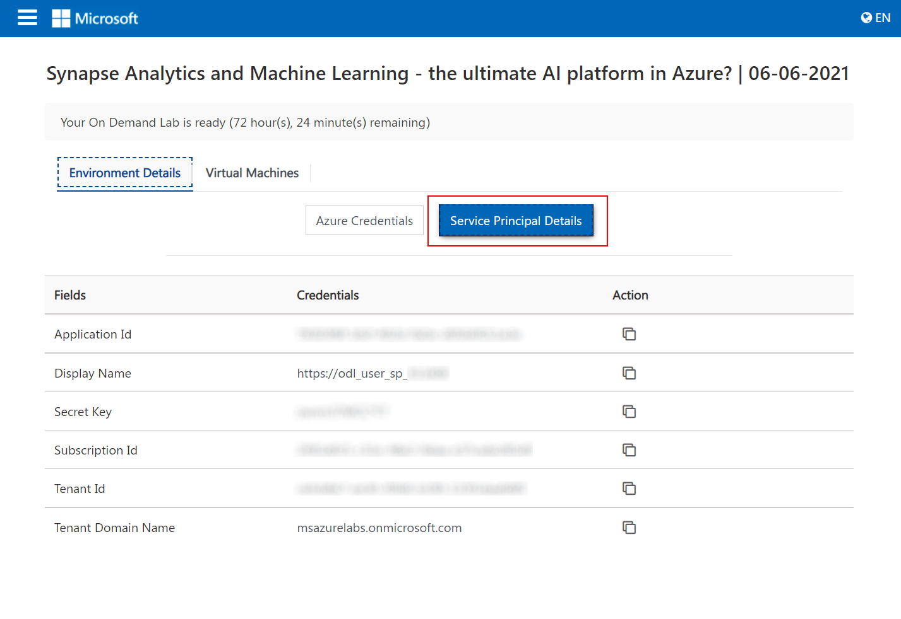

## Exercise 1 - Create an Azure Machine Learning linked service

In this exercise, you will create and configure an Azure Machine Learning linked service in Synapse Studio. Once the linked service is available, you will explore the Azure Machine Learning integration features in Synapse Studio.

### Task 1 - Create and configure an Azure Machine Learning linked service in Synapse Studio

The Synapse Analytics linked service authenticates with Azure Machine Learning using a service principal. The service principal is based on an Azure Active Directory application named `Azure Synapse Analytics GA Labs` and has already been created for you by the deployment procedure. The secret associated with the service principal has also been created and saved in the Azure Key Vault instance, under the `ASA-GA-LABS` name.

>**NOTE**
>
>In the labs provided by this repo, the Azure AD application is used in a single Azure AD tenant which means it has exactly one service principal associated to it. Consequently, we will use the terms Azure AD application and service principal interchangeably. For a detailed explanation on Azure AD applications and security principals, see [Application and service principal objects in Azure Active Directory](https://docs.microsoft.com/en-us/azure/active-directory/develop/app-objects-and-service-principals).

To view the service principal, open the Azure portal and navigate to your instance of Azure Active directory. Select the `App registrations` section and you should see the `Azure Synapse Analytics GA Labs` application under the `Owned applications` tab.

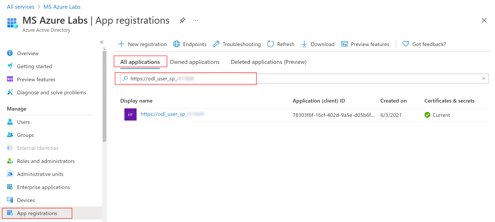

Select the application to view its properties and copy the value of the `Application (client) ID` property (you will need it in a moment to configure the linked service).

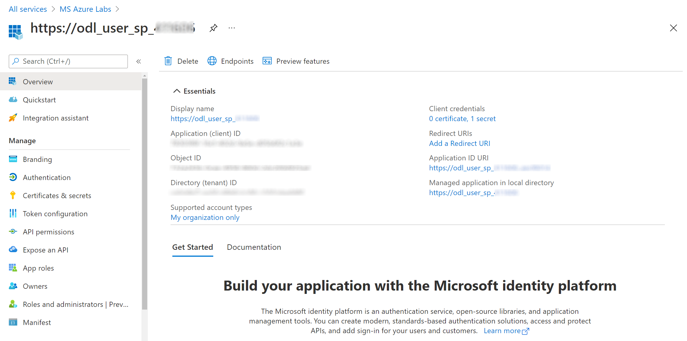

To view the secret, open the Azure Portal and navigate to the Azure Key Vault instance that has been created in your resource group. Select the `Secrets` section and you should see the `ASA-GA-LABS` secret:

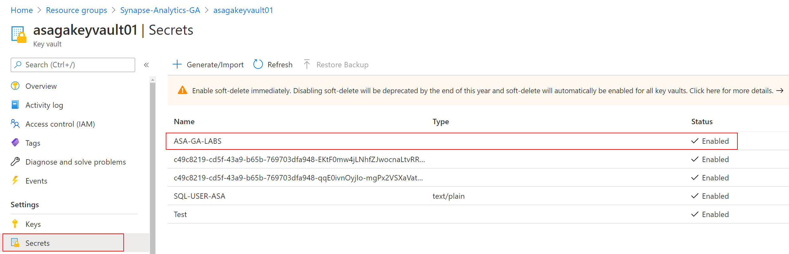

First, you need to make sure the service principal has permissions to work with the Azure Machine Learning workspace. Open the Azure Portal and navigate to the Azure Machine Learning workspace that has been created in your resource group. Select the `Access control (IAM)` section on the left, then select `+ Add` and `Add role assignment`. In the `Add role assignment` dialog, select the `Contributor` role, select `Azure Synapse Analytics GA Labs` service principal, and the select `Save`.

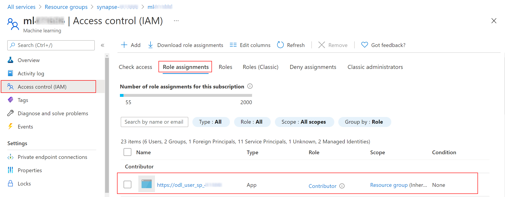

You are now ready to create the Azure Machine Learning linked service.

To create a new linked service, open your Synapse workspace, open Synapse Studio, select the `Manage` hub, select `Linked services`, and the select `+ New`. In the search field from the `New linked service` dialog, enter `Azure Machine Learning`. Select the `Azure Machine Learning` option and then select `Continue`.

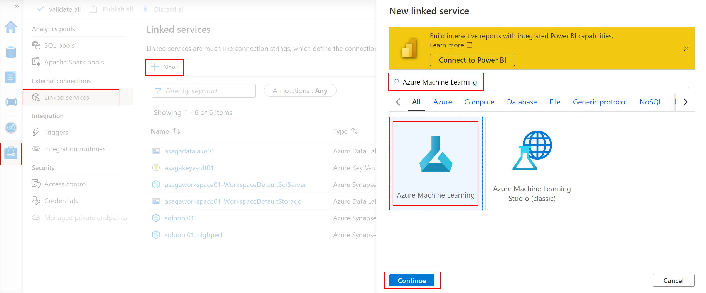

In the `New linked service (Azure Machine Learning)` dialog, provide the following properties:

- Name: enter `asagamachinelearning01`.
- Azure subscription: make sure the Azure subscription containing your resource group is selected.
- Azure Machine Learning workspace name: make sure your Azure Machine Learning workspace is selected.
- Notice how `Tenant identifier` has been already filled in for you.
- Service principal ID: enter the application client ID that you copied earlier.
- Select the `Azure Key Vault` option.
- AKV linked service: make sure your Azure Key Vault service is selected.
- Secret name: enter `ASA-GA-LABS`.

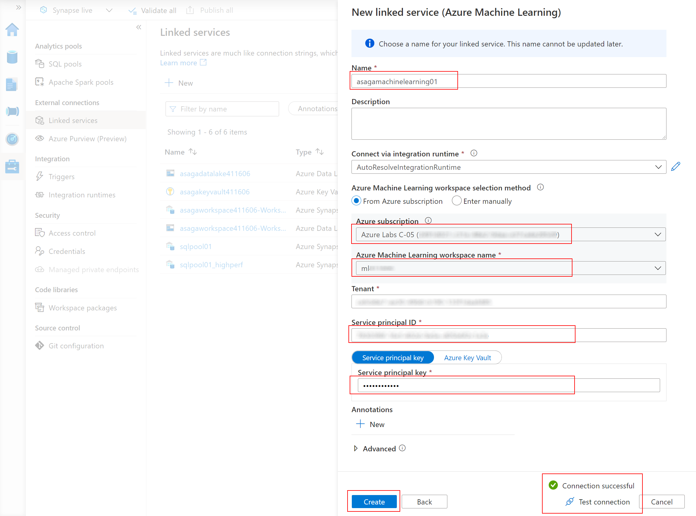

Next, select `Test connection` to make sure all settings are correct, and then select `Create`. The Azure Machine Learning linked service will now be created in the Synapse Analytics workspace.

>**IMPORTANT**
>
>The linked service is not complete until you publish it to the workspace. Notice the indicator near your Azure Machine Learning linked service. To publish it, select `Publish all` and then `Publish`.

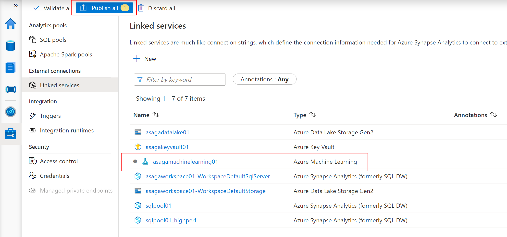

### Task 2 - Explore Azure Machine Learning integration features in Synapse Studio

First, we need to create a Spark table as a starting point for the Machine Learning model trainig process. In Synapse Studio, select the `Data` hub and then the `Linked` section. In the primary `Azure Data Lake Storage Gen 2` account, select the `wwi-02` file system, and then select the `sale-small-20191201-snappy.parquet` file under `wwi-02\sale-small\Year=2019\Quarter=Q4\Month=12\Day=20191201`. Right click the file and select `New notebook -> New Spark table`.

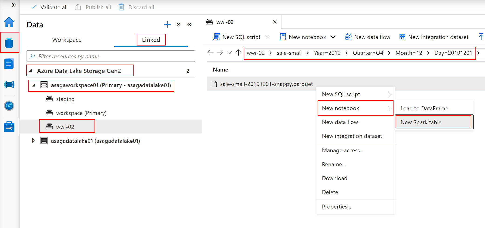

Replace the content of the notebook cell with the following code and then run the cell:

```python
import pyspark.sql.functions as f

df = spark.read.load('abfss://wwi-02@<data_lake_account_name>.dfs.core.windows.net/sale-small/Year=2019/Quarter=Q4/Month=12/*/*.parquet',
    format='parquet')
df_consolidated = df.groupBy('ProductId', 'TransactionDate', 'Hour').agg(f.sum('Quantity').alias('TotalQuantity'))
df_consolidated.write.mode("overwrite").saveAsTable("default.SaleConsolidated")
```

>**NOTE**:
>
>Replace `<data_lake_account_name>` with the actual name of your Synapse Analytics primary data lake account.

The code takes all data available for December 2019 and aggregates it at the `ProductId`, `TransactionDate`, and `Hour` level, calculating the total product quantities sold as `TotalQuantity`. The result is then saved as a Spark table named `SaleConsolidated`. To view the table in the `Data`hub, expand the `default (Spark)` database in the `Workspace` section. Your table will show up in the `Tables` folder. Select the three dots at the right of the table name to view the `Machine Learning` option in the context menu.

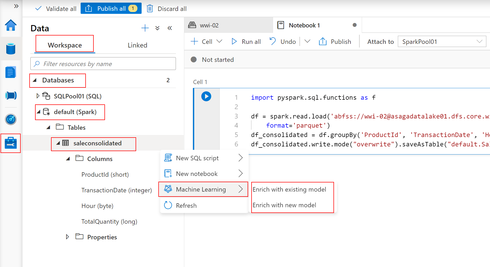

The following options are available in the `Machine Learning` section:

- Enrich with new model: allows you to start an AutoML experiment to train a new model.
- Enrich with existing model: allows you to use an existing Azure Cognitive Services model.

## Exercise 2 - Trigger an Auto ML experiment using data from a Spark table

In this exercise, you will trigger the execution of an Auto ML experiment and view its progress in Azure Machine learning studio.

### Task 1 - Trigger a regression Auto ML experiment on a Spark table

To trigger the execution of a new AutoML experiment, select the `Data` hub and then select the `...` area on the right of the `saleconsolidated` Spark table to activate the context menu.

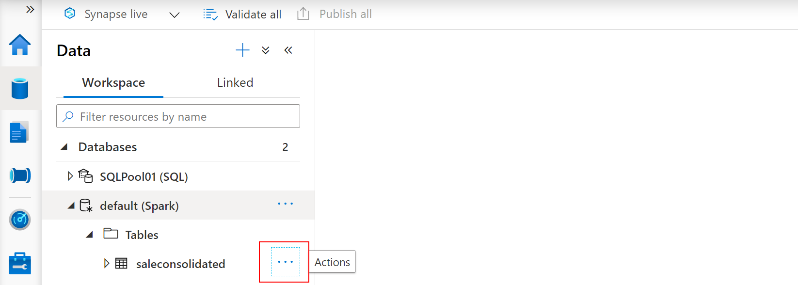

From the context menu, select `Enrich with new model`.


The `Enrich with new model` dialog allow you to set the properties for the Azure Machine Learning experiment. Provide values as follows:

- **Azure Machine Learning workspace**: leave unchanged, should be automaticall populated with your Azure Machine Learning workspace name.
- **Experiment name**: leave unchanged, a name will be automatically suggested.
- **Best model name**: leave unchanged, a name will be automatically suggested. Save this name as you will need it later to identify the model in the Azure Machine Learning Studio.
- **Target column**: Select `TotalQuantity(long)` - this is the feature you are looking to predict.
- **Spark pool**: leave unchanged, should be automaticall populated with your Spark pool name.

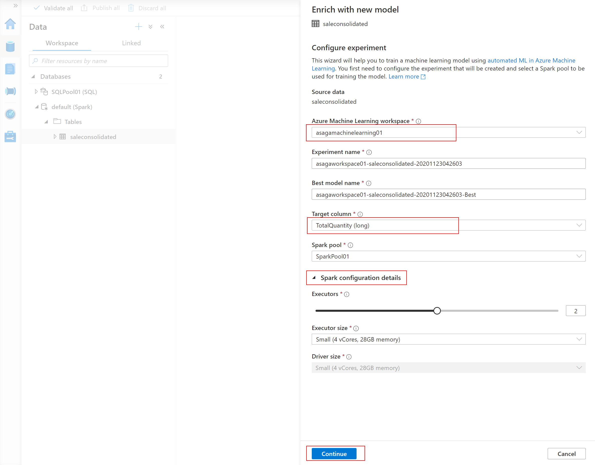

Notice the Apache Spark configuration details:

- The number of executors that will be used
- The size of the executor

Select `Continue` to advance with the configuration of your Auto ML experiment.

Next, you will choose the model type. In this case, the choice will be `Regression` as we try to predict a continuous numerical value. After selecting the model type, select `Continue` to advance.

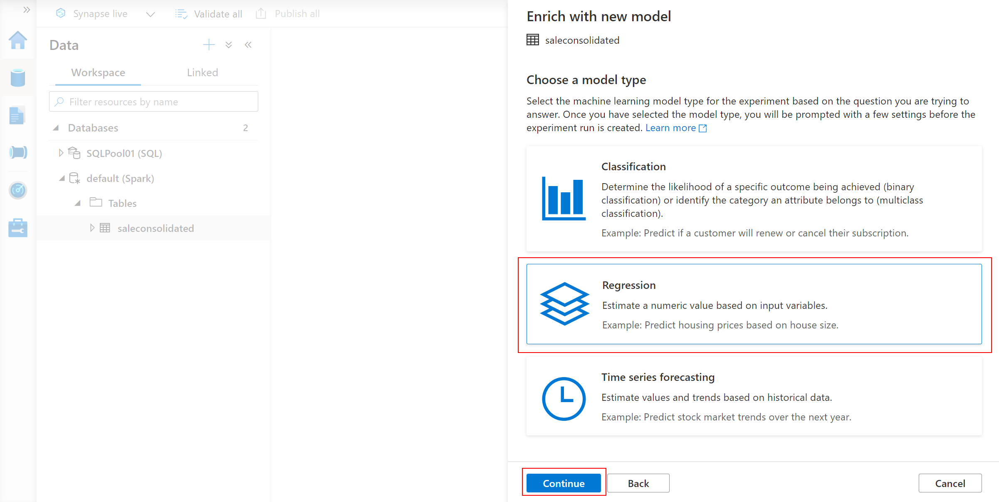

On the `Configure regression model` dialog, provide values as follows:

- **Primary metric**: leave unchanged, `Spearman correlation` should be suggested by default.
- **Training job time (hours)**: set to 0.25 to force the process to finish after 15 minutes.
- **Max concurrent iterations**: leave unchanged.
- **ONNX model compatibility**: set to `Enable` - this is very important as currently only ONNX models are supported in the Synapse Studio integrated experience.

Once you have set all the values, select `Create run` to advance.

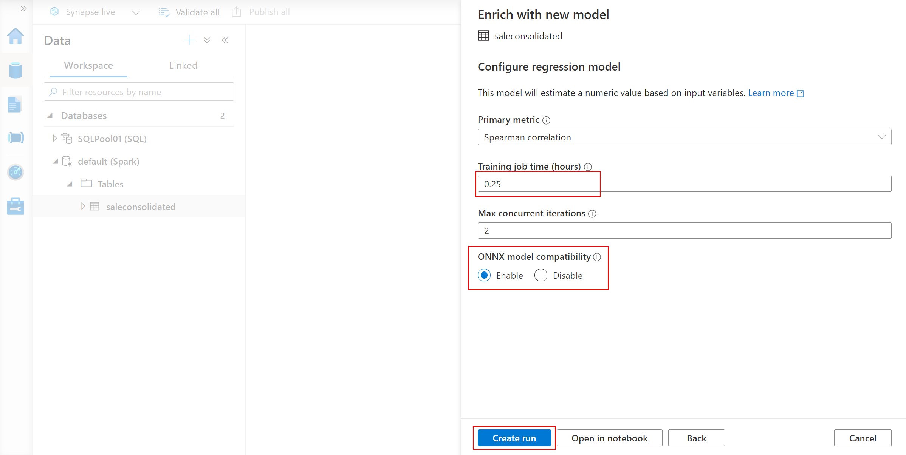

As your run is being submitted, a notification will pop up instructing you to wait until the Auto ML run is submited. You can check the status of the notification by selecting the `Notifications` icon on the top right part of your screen.

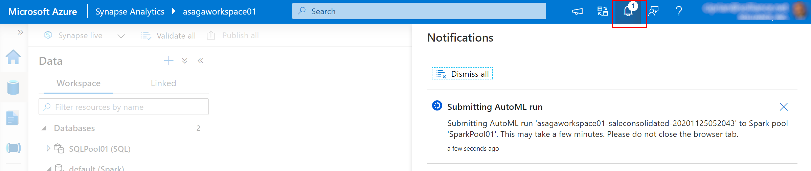

Once your run is successfully submitted, you will get another notification that will inform you about the actual start of the Auto ML experiment run.

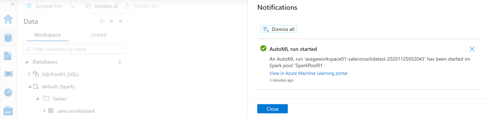

>**NOTE**
>
>Alongside the `Create run` option you might have noticed the `Open in notebook option`. Selecting that option allows you to review the actual Python code that is used to submit the Auto ML run. As an exercise, try re-doing all the steps in this task, but instead of selecting `Create run`, select `Open in notebook`. You should see a notebook similar to this:
>
>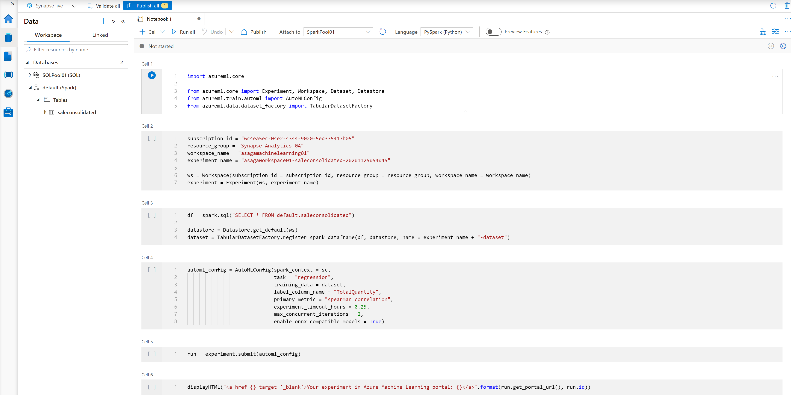
>
>Take a moment to read through the code that is generated for you. The total time elapsed for the experiment run will take around 20 minutes.

### Task 2 - View experiment details in Azure Machine Learning workspace

To view the experiment run you just started, open the Azure Portal, select your resource group, and then select the Azure Machine Learning workspace from the resource group.

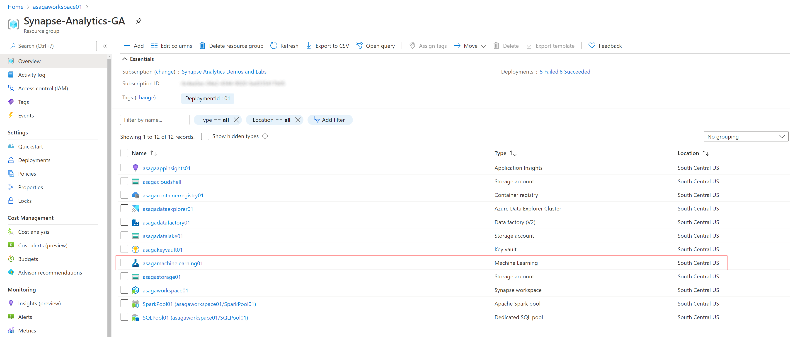

Locate and select the `Launch studio` button to start the Azure Machine Learning Studio.

In Azure Machine Leanring Studio, select the `Automated ML` section on the left and identify the experiment run you have just started. Note the experiment name, the `Running status`, and the `local` compute target.

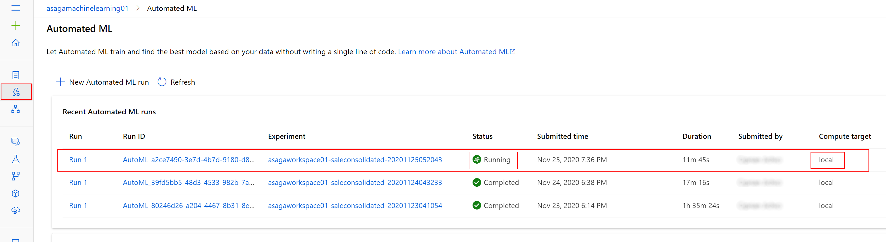

The reason why you see `local` as the compute target is because you are running the AutoML experiment on the Spark pool inside Synapse Analytics. From the point of view of Azure Machine Learning, you are not running your experiment on Azure Machine Learning's compute resources, but on your "local" compute resources.

Select your run, and then select the `Models` tab to view the current list of models being built by your run. The models are listed in descending order of the metric value (which is `Spearman correlation` in this case), the best ones being listed first.

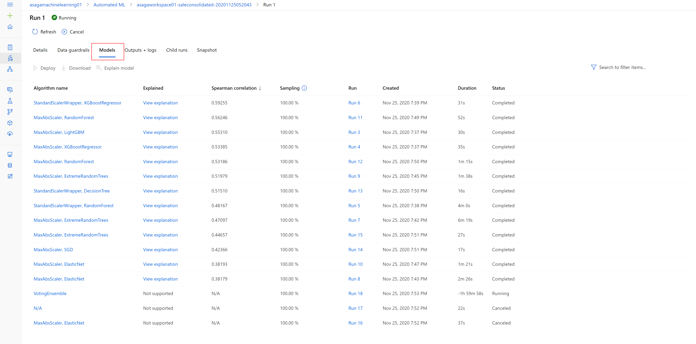

Select the best model (the one at the top of the list) then click on `View Explanations` to open the `Explanations (preview)` tab to see the model explanation. You are now able to select one of the explanations, then choose `Aggregates` to see the global importance of the input features. For your model, the feature that influences the most the value of the predicted value is   `ProductId`.

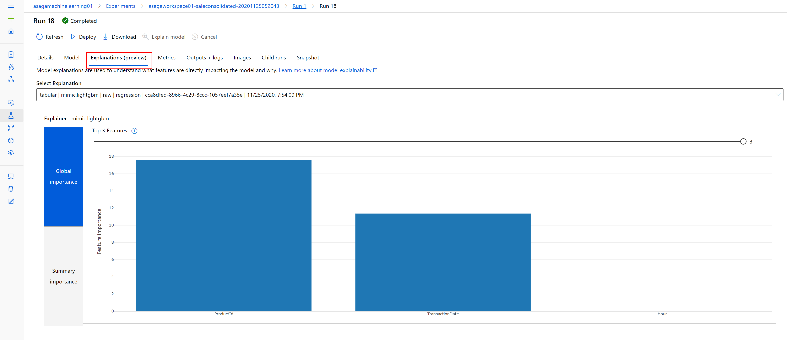

Next, select the `Models` section on the left in Azure Machine Learning Studio and see your best model registered with Azure Machine Learning. This allows you to refer to this model later on in this lab.

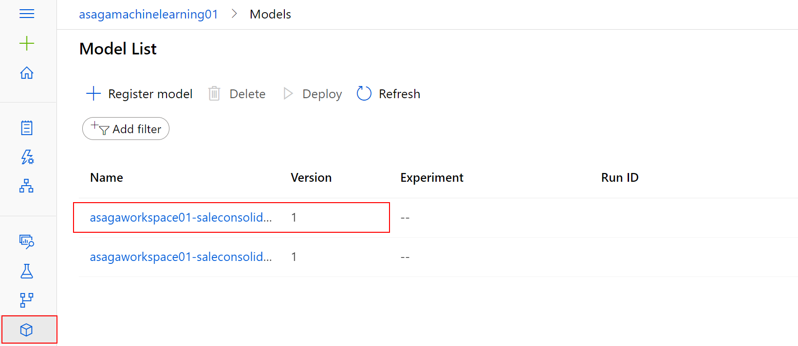

## Resources

To learn more about the topics covered in this lab, use these resources:

- [Quickstart: Create a new Azure Machine Learning linked service in Synapse](https://docs.microsoft.com/en-us/azure/synapse-analytics/machine-learning/quickstart-integrate-azure-machine-learning)
- [Tutorial: Machine learning model scoring wizard for dedicated SQL pools](https://docs.microsoft.com/en-us/azure/synapse-analytics/machine-learning/tutorial-sql-pool-model-scoring-wizard)
